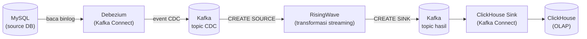

# Kelas Data Streaming — End-to-End CDC Pipeline

Membangun pipeline **Change Data Capture (CDC)** end-to-end: perubahan data di MySQL ditangkap secara real-time, ditransformasi secara streaming, dan mendarat di ClickHouse sebagai data siap analitik — semuanya berjalan lokal menggunakan Docker.

## Arsitektur



| Komponen | Peran |
|---|---|
| **MySQL** | Database sumber (OLTP). Memakai database yang sudah ada — tidak dijalankan di Docker. |
| **Debezium** | Membaca binlog MySQL dan menerbitkan setiap perubahan (insert/update/delete) sebagai event ke Kafka. Berjalan di atas Kafka Connect. |
| **Kafka** | Message broker — jalur transport event, dipakai dua kali: topic CDC mentah dan topic hasil transformasi. |
| **AKHQ** | Web UI untuk melihat isi topic Kafka. |
| **RisingWave** | Streaming database — membaca topic CDC, transformasi dengan SQL (materialized view), hasilnya di-sink kembali ke Kafka. Protokolnya kompatibel PostgreSQL. |
| **Kafka Connect** | Framework yang menjalankan connector: Debezium (source) dan ClickHouse Sink. |
| **ClickHouse** | Database OLAP tujuan akhir — tempat data siap dianalisis. |

## Prasyarat

1. **Akses jaringan ke MySQL source** — database source berada di jaringan privat, pastikan **VPN tersambung** sebelum menjalankan pipeline.
2. **Docker + Docker Compose** — lihat instalasi per OS di bawah.
3. **Client CLI** — `mysql` (cek source DB & demo insert/update) dan `psql` (inspeksi RisingWave).
4. **Python 3.9+ dan dbt** — transformasi RisingWave di-deploy lewat dbt dengan adapter `dbt-risingwave`.

### Instalasi Docker

**macOS** — pakai salah satu:

```bash
# Opsi A: OrbStack (ringan & cepat, khusus macOS)
brew install --cask orbstack
open -a OrbStack

# Opsi B: Docker Desktop
brew install --cask docker-desktop
open -a Docker
```

**Windows** — OrbStack tidak tersedia di Windows, gunakan **Docker Desktop** dengan backend WSL2:

```powershell
# 1. Aktifkan WSL2 (jalankan di PowerShell sebagai Administrator, lalu restart)
wsl --install

# 2. Install Docker Desktop
winget install -e --id Docker.DockerDesktop
```

Setelah terpasang, buka Docker Desktop dan pastikan **Settings → General → "Use the WSL 2 based engine"** aktif.

**Linux (Ubuntu/Debian)**:

```bash
sudo apt-get update && sudo apt-get install -y docker.io docker-compose-v2
sudo usermod -aG docker $USER   # logout-login agar berlaku
```

**Verifikasi (semua OS):**

```bash
docker --version
docker compose version
docker run --rm hello-world   # harus muncul "Hello from Docker!"
```

### Instalasi Client CLI

**macOS:**

```bash
brew install mysql-client libpq
echo 'export PATH="/opt/homebrew/opt/mysql-client/bin:/opt/homebrew/opt/libpq/bin:$PATH"' >> ~/.zshrc
source ~/.zshrc
mysql --version && psql --version
```

**Windows** — pilihan termudah:

- **DBeaver** (GUI gratis, cukup satu aplikasi untuk semua) — lihat [Instalasi DBeaver](#instalasi-dbeaver-gui--opsional-tapi-direkomendasikan) di bawah.
- Atau jalankan client lewat Docker tanpa install apa pun:

  ```powershell
  # mysql client
  docker run -it --rm mysql:8.0 mysql -h <MYSQL_HOST> -u <MYSQL_USER> -p
  # psql (ke RisingWave yang jalan di host)
  docker run -it --rm postgres:16 psql -h host.docker.internal -p 4566 -d dev -U root
  ```

**Linux:**

```bash
sudo apt-get install -y mysql-client postgresql-client
```

### Instalasi Python (3.9+)

**macOS** — cek dulu, biasanya sudah ada (`python3 --version`). Kalau belum:

```bash
brew install python
python3 --version
```

**Windows:**

```powershell
winget install -e --id Python.Python.3.12
# buka terminal BARU setelah install, lalu cek:
py --version
```

**Linux (Ubuntu/Debian):**

```bash
sudo apt-get update && sudo apt-get install -y python3 python3-venv python3-pip
python3 --version
```

### Instalasi dbt (dbt-risingwave)

Dijalankan di dalam virtual environment Python agar tidak mengganggu instalasi lain:

```bash
# macOS / Linux
cd coc_streaming
python3 -m venv venv
source venv/bin/activate
pip install dbt-risingwave "python-dotenv[cli]"
dbt --version
```

```powershell
# Windows
cd coc_streaming
py -m venv venv
venv\Scripts\activate
pip install dbt-risingwave "python-dotenv[cli]"
dbt --version
```

### curl & jq

`curl` dipakai untuk mendaftarkan connector ke Kafka Connect, `jq` untuk merapikan output JSON-nya.

- **curl** — sudah bawaan di macOS, Linux, dan Windows 10/11, tidak perlu install. Khusus **PowerShell**: `curl` di sana adalah alias `Invoke-WebRequest`, bukan curl asli — gunakan **`curl.exe`** (atau jalankan perintahnya di Git Bash/CMD):

  ```powershell
  curl.exe --version
  ```

- **jq** — belum bawaan di semua OS:

  ```bash
  # macOS
  brew install jq
  ```

  ```powershell
  # Windows
  winget install -e --id jqlang.jq
  ```

  ```bash
  # Linux (Ubuntu/Debian)
  sudo apt-get install -y jq
  ```

### Instalasi DBeaver (GUI — opsional tapi direkomendasikan)

DBeaver Community Edition gratis dan bisa connect ke **semua** database di pipeline ini: MySQL, RisingWave (memakai driver PostgreSQL), dan ClickHouse — cocok bagi yang kurang nyaman di terminal.

```bash
# macOS
brew install --cask dbeaver-community
```

```powershell
# Windows
winget install -e --id dbeaver.dbeaver
```

```bash
# Linux (Ubuntu/Debian)
sudo snap install dbeaver-ce
```

Atau unduh installer langsung dari https://dbeaver.io/download/.

## Verifikasi Koneksi & Kesiapan CDC MySQL Source

Sebelum memasang Debezium, pastikan dulu source database **bisa diakses** dan **CDC-ready** (binlog menyala dengan format yang benar, dan user punya privilege replication).

Tes cepat dulu apakah MySQL-nya reachable (kalau gagal, biasanya VPN belum tersambung):

```bash
set -a; source .env-staging; set +a
nc -z -w 5 "$MYSQL_HOST" "$MYSQL_PORT" && echo "reachable ✅" || echo "tidak reachable — cek VPN"
```

Lalu cek kesiapan CDC-nya — pilih salah satu cara di bawah.

### Cara A — via Terminal (mysql CLI)

```bash
cd coc_streaming
set -a; source .env-staging; set +a   # load kredensial jadi environment variable

mysql -h "$MYSQL_HOST" -P "$MYSQL_PORT" -u "$MYSQL_USERNAME" -p"$MYSQL_PASSWORD" \
  -e "SELECT VERSION();
      SHOW VARIABLES LIKE 'log_bin';
      SHOW VARIABLES LIKE 'binlog_format';
      SHOW VARIABLES LIKE 'binlog_row_image';
      SHOW GRANTS FOR CURRENT_USER();"
```

### Cara B — via DBeaver

1. **Buat koneksi**: menu **Database → New Database Connection → MySQL → Next**.
2. Isi form dari nilai di `.env-staging`:
   - **Server Host**: nilai `MYSQL_HOST`
   - **Port**: nilai `MYSQL_PORT` (3306)
   - **Database**: nilai `MYSQL_DATABASE`
   - **Username / Password**: nilai `MYSQL_USERNAME` / `MYSQL_PASSWORD`
3. Jika diminta, klik **Download** untuk mengunduh driver MySQL (sekali saja).
4. ⚠️ Tips MySQL 8: jika muncul error *"Public Key Retrieval is not allowed"*, buka tab **Driver properties** → set `allowPublicKeyRetrieval` = `true`.
5. Klik **Test Connection** — harus hijau — lalu **Finish**.
6. Buka SQL editor: klik kanan koneksi → **SQL Editor → New SQL script**, lalu jalankan query berikut (blok semua, tekan **Alt+X** / **⌥X** untuk execute script):

```sql
SELECT VERSION();
SHOW VARIABLES LIKE 'log_bin';
SHOW VARIABLES LIKE 'binlog_format';
SHOW VARIABLES LIKE 'binlog_row_image';
SHOW GRANTS FOR CURRENT_USER();
```

### Hasil yang Diharapkan

| Pemeriksaan | Nilai wajib | Kenapa penting untuk Debezium |
|---|---|---|
| `log_bin` | `ON` | Binlog adalah "sumber kebenaran" CDC — tanpa ini tidak ada event yang bisa dibaca. |
| `binlog_format` | `ROW` | Debezium butuh isi baris yang berubah, bukan statement SQL-nya (`STATEMENT`/`MIXED` tidak didukung). |
| `binlog_row_image` | `FULL` | Agar event memuat seluruh kolom (nilai lama & baru), bukan hanya kolom yang berubah. |
| `SHOW GRANTS` | `SELECT`, `REPLICATION SLAVE`, `REPLICATION CLIENT` | `SELECT` untuk snapshot awal; `REPLICATION SLAVE/CLIENT` agar bisa menyamar sebagai replica dan membaca binlog. |

> Jika ada nilai yang belum sesuai: di RDS ubah lewat **Parameter Group** (`binlog_format`, `binlog_row_image`), dan pastikan *automated backup* aktif agar binlog menyala. Privilege ditambahkan lewat `GRANT SELECT, REPLICATION SLAVE, REPLICATION CLIENT ON *.* TO '<user>'@'%';`.

## Struktur Project

```
coc_streaming/
├── README.md
├── .env-staging              # kredensial MySQL source (JANGAN di-commit!)
├── .env-local                # environment stack Docker lokal (RisingWave, Kafka, ClickHouse)
├── docker-compose.yaml       # Kafka, AKHQ, Kafka Connect, RisingWave, ClickHouse
├── connectors/
│   ├── debezium-mysql-source.json    # config connector CDC MySQL → Kafka
│   └── clickhouse-sink.json          # config connector Kafka → ClickHouse
│
│   # ---- project dbt (adapter dbt-risingwave) ----
├── dbt_project.yml
├── profiles.yml
├── macros/
│   └── materializations/risingwave_mv.sql
└── models/
    ├── source/               # CREATE TABLE ... connector 'kafka' — baca topic CDC (5 tabel material)
    ├── mv/ws_materials.sql   # CREATE MATERIALIZED VIEW — join 5 tabel jadi satu view material
    └── sink/sink_ws_materials.sql   # CREATE SINK — tulis hasil ke topic Kafka baru
```

## Menjalankan Stack Docker & Verifikasi

Validasi dulu sintaks compose-nya, lalu nyalakan seluruh stack:

```bash
docker compose config --quiet && echo "compose valid"

docker compose up -d
docker compose ps   # tunggu semua service berstatus healthy
```

> Boot pertama butuh waktu: unduh image ±2–3 GB, dan `kafka-connect` paling lama (2–5 menit) karena mengunduh plugin connector dari Confluent Hub saat container dibuat. Progresnya bisa dilihat dengan `docker logs -f kafka-connect`.

Setelah semua `healthy`, verifikasi tiap komponen:

**1. Kafka Connect** — cek plugin connector yang berhasil dimuat:

```bash
curl -s http://localhost:8083/connector-plugins | jq '.[].class'
```

Output harus memuat dua baris ini (abaikan MirrorMaker bawaan):

```
"com.clickhouse.kafka.connect.ClickHouseSinkConnector"
"io.debezium.connector.mysql.MySqlConnector"
```

**2. RisingWave** — connect via protokol PostgreSQL:

```bash
psql -h localhost -p 4566 -d dev -U root -c "SELECT version();"
```

**3. ClickHouse:**

```bash
curl -u default:clickhouse123 "http://localhost:8123/?query=SELECT%201"
```

**4. Web UI** — buka di browser:
- AKHQ (topic & connector Kafka): http://localhost:8080
- Dashboard RisingWave: http://localhost:5691

> ⚠️ **Troubleshooting:** kalau plugin di langkah 1 tidak muncul padahal `docker-compose.yaml` sudah benar, jalankan ulang `docker compose up -d`. Plugin diinstall **saat container dibuat**, jadi `docker restart` saja tidak cukup — container-nya harus di-recreate (compose otomatis melakukannya kalau mendeteksi config berubah).

## Alur Menjalankan Pipeline (Ringkasan)

1. Sambungkan VPN, lalu verifikasi akses & kesiapan CDC MySQL source (lihat [Verifikasi Koneksi & Kesiapan CDC MySQL Source](#verifikasi-koneksi--kesiapan-cdc-mysql-source)).
2. `docker compose up -d` — nyalakan seluruh stack.
3. Verifikasi semua service sehat (lihat [Menjalankan Stack Docker & Verifikasi](#menjalankan-stack-docker--verifikasi)).
4. Daftarkan Debezium MySQL source connector ke Kafka Connect (kredensial MySQL diisi langsung di file JSON — sesuaikan dengan database source masing-masing):

   ```bash
   curl -sS -X POST -H "Content-Type: application/json" \
     -d @connectors/debezium-mysql-source.json \
     http://localhost:8083/connectors | jq

   # cek statusnya — state connector & task harus RUNNING:
   curl -s http://localhost:8083/connectors/mysql-debezium-materials/status | jq
   ```

   > Kalau `status` dicek terlalu cepat setelah POST, bisa muncul `404 No status found` — status connector ditulis secara asinkron. Tunggu 1–2 detik lalu ulangi.

   > `POST /connectors` menolak (409) kalau connector dengan nama sama sudah ada. Untuk mendaftar ulang, hapus dulu:
   >
   > ```bash
   > curl -X DELETE http://localhost:8083/connectors/mysql-debezium-materials
   > ```
   >
   > Konfigurasi penting di JSON-nya:
   > - `database.server.id` — ID unik saat Debezium "menyamar" sebagai replica MySQL. Tidak boleh bentrok dengan client replikasi lain di DB yang sama — pipeline staging asli memakai range `918xxxxxx`, makanya di sini dipakai `919000001`.
   > - `topic.prefix: smile` + SMT `dropPrefix` (RegexRouter) — Debezium menamai topic `smile.<database>.<tabel>`, lalu RegexRouter membuang prefix-nya sehingga nama topic akhir menjadi **`<database>.<tabel>`** (mis. `staging_smile5_20260212.materials`), sesuai konvensi real project.
   > - `snapshot.mode: initial` — baca seluruh isi tabel dulu, lalu lanjut streaming binlog.
   > - `decimal.handling.mode: double` — kolom DECIMAL dikirim sebagai angka JSON biasa (default-nya bytes base64, tidak terbaca consumer).
   > - SMT `unwrap` (ExtractNewRecordState) — membongkar envelope Debezium menjadi JSON datar; row yang di-DELETE menjadi record dengan `__deleted='true'`.
   > - `skip.messages.without.change` + `connect.keep.alive` — hemat traffic (update tanpa perubahan kolom ter-capture tidak dikirim) dan menjaga koneksi ke MySQL tetap hidup.

5. Verifikasi 5 topic CDC (`staging_smile5_20260212.materials`, dst.) muncul dan berisi event di AKHQ (http://localhost:8080) — atau lewat CLI:

   ```bash
   docker exec kafka /opt/kafka/bin/kafka-topics.sh --bootstrap-server localhost:29092 --list
   ```
6. Jalankan dbt (env var di-inject dari file .env memakai `dotenv`) — validasi dulu, lalu deploy ke RisingWave: table source (baca topic CDC), materialized view (transformasi), dan sink (tulis hasil ke topic Kafka baru):

   ```bash
   dotenv -f .env-local run dbt debug    # tes koneksi ke RisingWave
   dotenv -f .env-local run dbt parse    # cek sintaks semua model tanpa eksekusi
   ```

   Lalu deploy — bisa bertahap (enak untuk melihat layer per layer) atau sekali jalan:

   ```bash
   # Opsi A — bertahap: 5 table source dulu...
   dotenv -f .env-local run dbt run -s models/source --full-refresh

   # ...verifikasi datanya masuk...
   psql -h localhost -p 4566 -d dev -U root -c "SHOW TABLES;"
   psql -h localhost -p 4566 -d dev -U root -c "SELECT COUNT(*) FROM materials;"

   # ...baru deploy MV-nya
   dotenv -f .env-local run dbt run -s ws_materials --full-refresh
   ```

   ```bash
   # Opsi B — sekali jalan: MV + semua upstream-nya (tanda +)
   dotenv -f .env-local run dbt run -s +ws_materials --full-refresh
   ```
7. Verifikasi lewat `psql`/DBeaver: data mengalir di table source & MV RisingWave, dan topic hasil sink muncul di AKHQ. (Catatan DBeaver: tabel baru tidak langsung terlihat — klik kanan koneksi → **Refresh**/F5, dan pastikan database koneksi = `dev`.)
8. Buat tabel tujuan di ClickHouse, lalu daftarkan ClickHouse Sink connector (config-nya literal semua, tidak perlu envsubst) → data mengalir ke tabel ClickHouse:

   ```bash
   curl -sS -X PUT -H "Content-Type: application/json" \
     -d @connectors/clickhouse-sink.json \
     http://localhost:8083/connectors/clickhouse-sink-ws-materials/config | jq
   ```
9. Uji end-to-end: `INSERT`/`UPDATE` di MySQL → perubahan muncul di ClickHouse dalam hitungan detik.

## Port yang Dipakai

| Service | Port | Keterangan |
|---|---|---|
| Kafka | 9092 | Bootstrap server (dari host) |
| AKHQ | 8080 | Web UI Kafka |
| Kafka Connect | 8083 | REST API pendaftaran connector |
| RisingWave | 4566 | Protokol PostgreSQL (`psql`) |
| ClickHouse | 8123 / 9000 | HTTP / native protocol |

## Catatan Keamanan

File `.env-staging` berisi kredensial asli — **jangan pernah di-commit ke git**. Jika project ini di-git-kan, pastikan `.env*` masuk `.gitignore`.
